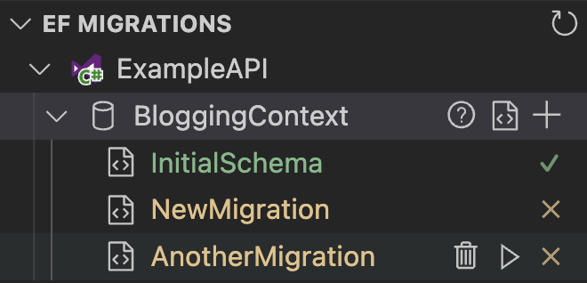
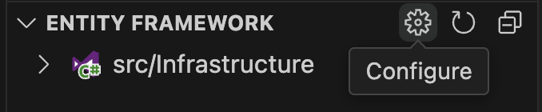
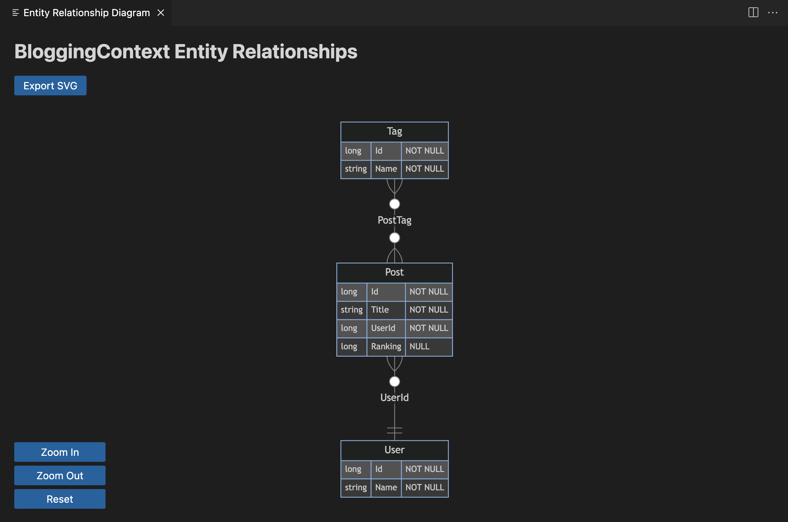

# Entity Framework

[](https://github.com/badsyntax/vscode-entity-framework/actions/workflows/main.yml)

A VS Code extension to manage Entity Framework migrations.



## Requirements

- [dotnet sdk](https://dotnet.microsoft.com/download)
- [efcore tools](https://learn.microsoft.com/en-us/ef/core/cli/dotnet)
- [Microsoft.EntityFrameworkCore.Design](https://www.nuget.org/packages/Microsoft.EntityFrameworkCore.Design) must be installed in one of the projects

## Features

- List migrations by [`DbContext`](https://learn.microsoft.com/en-us/dotnet/api/microsoft.entityframeworkcore.dbcontext)
- Add / Remove / Run / Undo migrations
- Show migration applied status
- Reset (Squash) Migrations
- Export `DbContext` as SQL script
- View `DbContext` information
- [Scaffold](https://learn.microsoft.com/en-us/ef/core/cli/dotnet#dotnet-ef-dbcontext-scaffold) `DbContext` & entity types
- Generate ER Diagram (Requires EF Core 7+)

## Getting Started

Set the `project` and `startupProject` configuration for the workspace by clicking on the `Configure` icon in the tree view:



## Extension Settings

This extension contributes the following settings:

- `entityframework.project`: [Target Project](https://learn.microsoft.com/en-us/ef/core/cli/dotnet#target-project-and-startup-project)
  <details><summary>Example</summary>

  ```json
  {
    "entityframework.project": "src/Infrastructure"
  }
  ```

- `entityframework.startupProject`: [Startup Project](https://learn.microsoft.com/en-us/ef/core/cli/dotnet#target-project-and-startup-project)
  <details><summary>Example</summary>

  ```json
  {
    "entityframework.startupProject": "ExampleAPI"
  }
  ```

- `entityframework.commands`: Custom commands
  <details><summary>Example</summary>

  ```json
  {
    "entityframework.commands": {
      "addMigration": [
        "dotnet",
        "ef",
        "migrations",
        "add",
        "\"$migrationName\"",
        "--project",
        "\"$project\"",
        "--startup-project",
        "\"$startupProject\"",
        "--context",
        "\"$dbContext\""
      ],
      "removeMigration": [
        "dotnet",
        "ef",
        "migrations",
        "remove",
        "--project",
        "\"$project\"",
        "--startup-project",
        "\"$startupProject\"",
        "--context",
        "\"$dbContext\""
      ],
      "runMigration": [
        "dotnet",
        "ef",
        "database",
        "update",
        "--project",
        "\"$project\"",
        "--startup-project",
        "\"$startupProject\"",
        "--context",
        "\"$dbContext\"",
        "\"$migrationId\""
      ],
      "generateScript": [
        "dotnet",
        "ef",
        "dbcontext",
        "script",
        "--project",
        "\"$project\"",
        "--startup-project",
        "\"$startupProject\"",
        "--context",
        "\"$dbContext\""
      ],
      "listDbContexts": [
        "dotnet",
        "ef",
        "dbcontext",
        "list",
        "--project",
        "\"$project\"",
        "--startup-project",
        "\"$startupProject\""
      ],
      "listMigrations": [
        "dotnet",
        "ef",
        "migrations",
        "list",
        "--context",
        "\"$context\"",
        "--project",
        "\"$project\"",
        "--startup-project",
        "\"$startupProject\""
      ],
      "dbContextInfo": [
        "dotnet",
        "ef",
        "dbcontext",
        "info",
        "--context",
        "\"$dbContext\"",
        "--project",
        "\"$project\"",
        "--startup-project",
        "\"$startupProject\""
      ],
      "scaffold": [
        "dotnet",
        "ef",
        "dbcontext",
        "scaffold",
        "\"$connectionString\"",
        "\"$provider\"",
        "--output-dir",
        "\"$outputDir\"",
        "--context",
        "\"$context\"",
        "--project",
        "\"$project\"",
        "--context-dir",
        "\"$contextDir\"",
        "--namespace",
        "\"$namespace\""
      ],
      "generateERD": [
        "dotnet",
        "ef",
        "dbcontext",
        "scaffold",
        "\"$connectionString\"",
        "\"$provider\"",
        "--context",
        "\"$context\"",
        "--project",
        "\"$project\"",
        "--output-dir",
        "\"$outputDir\"",
        "--use-database-names"
      ]
    }
  }
  ```

  </details>

- `entityframework.erDiagram.ignoreTables`: A list of tables to ignore from the ER Diagram
  <details><summary>Example</summary>

  ```json
  {
    "entityframework.erDiagram": {
      "ignoreTables": [".*Tracking$"]
    }
  }
  ```

- `entityframework.env`: Custom environment variables
  <details><summary>Example</summary>

  ```json
  {
    "entityframework.env": {
      "ASPNETCORE_ENVIRONMENT": "LocalDev",
      "TenantId": "12345"
    }
  }
  ```

  </details>

### ER Diagram

When generating an ER diagram, a [`Mermaid`](https://mermaid.js.org/syntax/entityRelationshipDiagram.html) [`.t4`](https://learn.microsoft.com/en-us/ef/core/managing-schemas/scaffolding/templates) template will be installed into the project. You can ignore this file (by adding it to `.gitignore`), or add it to source control. The template file is used to generate the ER Diagram, feel free to customise it. If you delete it, it will be regenerated next time you generate an ER Diagram.



## Performance

The EF tools execute application code at design time to get information about the project, thus _performance on large projects can be slow_.

## Support

- 👉 [Submit a bug report](https://github.com/badsyntax/vscode-entity-framework/issues/new?assignees=badsyntax&labels=bug&template=bug_report.md&title=)
- 👉 [Submit a feature request](https://github.com/badsyntax/vscode-entity-framework/issues/new?assignees=badsyntax&labels=enhancement&template=feature_request.md&title=)

## License

See [LICENSE.md](./LICENSE.md).
